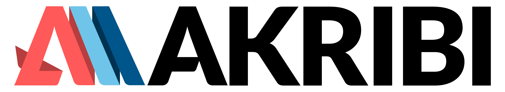

# Akribi Branding

## 🖼️ Logo

The logo is available in several different formats in `logo`.

### Main logo

#### SVG

### PNG

### Square logo

#### SVG

#### PNG

## 🎨 Color Palette

<table>
  <tr>
    <td style="background-color:#6DC6E7; width:100px; height:100px;"></td>
    <td style="background-color:#00558B; width:100px; height:100px;"></td>
    <td style="background-color:#FF5959; width:100px; height:100px;"></td>
    <td style="background-color:#FFC56C; width:100px; height:100px;"></td>
    <td style="background-color:#FF9C5A; width:100px; height:100px;"></td>
  </tr>
  <tr>
    <td><b>PMS:</b> 297C <b>CMYK:</b> 52.3.4.0 <b>RGB:</b> 109.198.231 <b>WEBB:</b> #6DC6E7</td>
    <td><b>PMS:</b> 647C <b>CMYK:</b> 98.71.21.5 <b>RGB:</b> 0.85.139 <b>WEBB:</b> #00558B</td>
    <td><b>PMS:</b> 178C <b>CMYK:</b> 0.80.60.0 <b>RGB:</b> 255.89.89 <b>WEBB:</b> #FF5959</td>
    <td><b>PMS:</b> 1355C <b>CMYK:</b> 0.24.66.0 <b>RGB:</b> 255.197.108 <b>WEBB:</b> #FFC56C</td>
    <td><b>PMS:</b> 157C <b>CMYK:</b> 0.47.70.0 <b>RGB:</b> 255.156.90 <b>WEBB:</b> #FF9C5A</td>
  </tr>
</table>

## 🔤 Typography Guidelines

| **Type**         | **Font**        | **Weight**       | **Usage**                           |
|------------------|-----------------|------------------|-------------------------------------|
| Headings (Light) | Roboto          | Light (300)      | Page titles, large headers          |
| Headings (Dark)  | Roboto          | Bold (700)       | Emphasis headings, section titles   |
| Body Text        | Varela Round    | Regular (400)    | Paragraphs, UI labels, descriptions |
